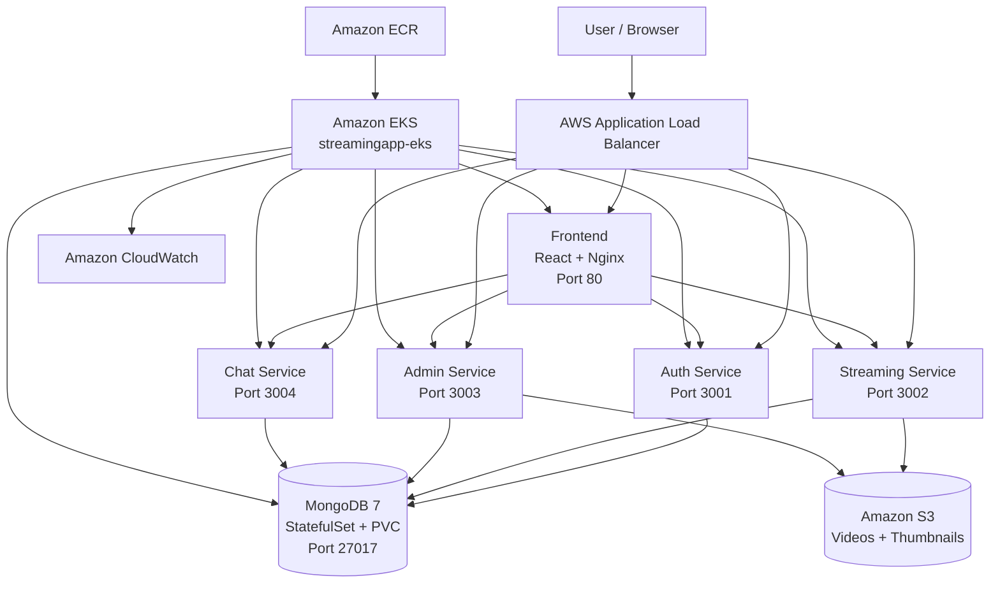

# StreamingApp — DevOps Project 5: Container Orchestration and Scaling

## 1. Project Overview

StreamingApp is a MERN-based video streaming platform composed of multiple microservices.

For **HeroVired DevOps Project 5 — Container Orchestration and Scaling**, the application was containerized and deployed to **Amazon EKS** using Docker, Kubernetes, Helm, Amazon ECR, Amazon S3, Application Load Balancer, and Amazon CloudWatch.

The project demonstrates:

- Docker containerization
- Docker Hub image publishing
- Amazon ECR repositories
- Amazon EKS cluster deployment
- Kubernetes Deployments and Services
- MongoDB StatefulSet
- Persistent storage using Kubernetes PVC and Amazon EBS
- Kubernetes ConfigMap and Secret
- Readiness and liveness probes
- AWS Load Balancer Controller
- Application Load Balancer (ALB) Ingress
- Helm-based deployment
- Horizontal scaling
- Rolling updates
- Kubernetes self-healing
- Amazon S3 object storage
- CloudWatch monitoring and centralized logging
- Jenkins CI/CD pipeline configuration

---

## 2. HeroVired Assignment

**Project:** DevOps Project 5 — Container Orchestration / Graded Project: Orchestration and Scaling

**Repository:**

https://github.com/aeupsc-png/StreamingApp

**AWS Region:**

`ap-south-1` (Asia Pacific - Mumbai)

**Kubernetes Namespace:**

`streamingapp`

**EKS Cluster:**

`streamingapp-eks`

---

## 3. Architecture



### Request routing

The Application Load Balancer routes requests as follows:

| Path | Kubernetes Service | Port |
|---|---|---:|
| `/` | frontend-service | 80 |
| `/api` | auth-service | 3001 |
| `/api/streaming` | streaming-service | 3002 |
| `/api/admin` | admin-service | 3003 |
| `/api/chat` | chat-service | 3004 |
| `/socket.io` | chat-service | 3004 |

The deployed ALB endpoint was:

`http://k8s-streamin-streamin-ca676dcfa1-273891216.ap-south-1.elb.amazonaws.com`

---

# 4. Application Components

| Component | Technology | Container Port | Kubernetes Service |
|---|---|---:|---|
| Auth Service | Node.js / Express | 3001 | auth-service |
| Streaming Service | Node.js / Express | 3002 | streaming-service |
| Admin Service | Node.js / Express | 3003 | admin-service |
| Chat Service | Node.js / Express / Socket.IO | 3004 | chat-service |
| Frontend | React / Nginx | 80 | frontend-service |
| MongoDB | MongoDB 7 | 27017 | mongodb |

---

# 5. Docker Containerization

Five application images were built.

## Docker Hub Images

| Component | Docker Hub Image | Version |
|---|---|---|
| Auth | `maahiv/streaming-auth` | `1.0.0` |
| Streaming | `maahiv/streaming-service` | `1.0.1` |
| Admin | `maahiv/streaming-admin` | `1.0.0` |
| Chat | `maahiv/streaming-chat` | `1.0.0` |
| Frontend | `maahiv/streaming-frontend` | `1.0.3` |

Docker Hub repositories:

- https://hub.docker.com/r/maahiv/streaming-auth
- https://hub.docker.com/r/maahiv/streaming-service
- https://hub.docker.com/r/maahiv/streaming-admin
- https://hub.docker.com/r/maahiv/streaming-chat
- https://hub.docker.com/r/maahiv/streaming-frontend

The images were successfully built and pushed to Docker Hub before Kubernetes deployment.

---

# 6. Amazon ECR

The EKS deployment uses Amazon ECR images.

AWS account:

`627917841032`

ECR registry:

`627917841032.dkr.ecr.ap-south-1.amazonaws.com`

Repositories:

```text
streaming-auth
streaming-service
streaming-admin
streaming-chat
streaming-frontend
```

Image versions used by the Helm deployment:

```text
streaming-auth:1.0.0
streaming-service:1.0.1
streaming-admin:1.0.0
streaming-chat:1.0.0
streaming-frontend:1.0.3
```

---

# 7. Amazon EKS

The application is deployed to:

```text
Cluster: streamingapp-eks
Region: ap-south-1
Kubernetes version: 1.35
Namespace: streamingapp
```

The cluster has multiple worker nodes distributed across Availability Zones.

A dedicated node group was used for MongoDB because the MongoDB PersistentVolume was provisioned in a specific Availability Zone.

The EKS environment also has:

- OIDC provider enabled
- Amazon EBS CSI driver
- AWS Load Balancer Controller
- Amazon CloudWatch Observability add-on

---

# 8. IAM and AWS Integration

The project uses IAM roles rather than storing AWS access keys inside the application repository.

Configured AWS integrations include:

### AWS Load Balancer Controller

Used to provision and manage the Application Load Balancer for the Kubernetes Ingress.

### EBS CSI Driver

Used to provision the MongoDB PersistentVolume using Amazon EBS.

### S3 Service Account

A Kubernetes service account named:

```text
streamingapp-s3
```

is associated with an IAM role that allows the application to access the required S3 objects.

### CloudWatch

An IAM role named:

```text
StreamingAppCloudWatchAgentRole
```

was configured for CloudWatch observability.

No AWS access keys, secret access keys, or passwords are committed to the repository.

---

# 9. Amazon S3

An S3 bucket was created for video and thumbnail storage:

```text
streamingapp-627917841032-ap-south-1
```

The application uses S3 for uploaded media.

The bucket contains objects under:

```text
videos/
thumbnails/
```

A test upload was successfully validated.

Example test objects:

```text
videos/1790402035958-streamingapp-test-video.mp4
thumbnails/1790402035064-streamingapp-test-thumbnail.jpg
```

---

# 10. Kubernetes Resources

All application resources are deployed in:

```text
namespace: streamingapp
```

The deployment contains:

- 2 Auth pods
- 3 Streaming pods
- 2 Admin pods
- 2 Chat pods
- 2 Frontend pods
- 1 MongoDB pod

Total application/database pods during final verification:

```text
11 pods
```

## Deployments

```text
auth
streaming
admin
chat
frontend
```

## Services

```text
auth-service
streaming-service
admin-service
chat-service
frontend-service
mongodb
```

---

# 11. MongoDB StatefulSet and Persistent Storage

MongoDB is deployed as a Kubernetes StatefulSet.

Configuration:

```text
Image: mongo:7
Replicas: 1
Storage: 10Gi
StorageClass: gp2
Access mode: ReadWriteOnce
```

The MongoDB PVC was verified as:

```text
Bound
```

MongoDB runs with persistent storage instead of ephemeral container storage.

This ensures that application data remains available when the MongoDB pod is recreated.

---

# 12. ConfigMap

Application configuration that is not secret is stored in a Kubernetes ConfigMap.

Important configuration includes:

```text
NODE_ENV=production
MONGO_URI=mongodb://mongodb:27017/streamingapp
AWS_REGION=ap-south-1
AWS_S3_BUCKET=streamingapp-627917841032-ap-south-1
STREAMING_PUBLIC_URL=/
```

Service ports are also defined through the Helm configuration.

---

# 13. Kubernetes Secret

Sensitive application configuration is stored in:

```text
streamingapp-secret
```

The Secret is used for the JWT secret and other sensitive configuration.

Secrets are not committed to GitHub.

---

# 14. Health Checks

Readiness and liveness probes were configured for the application deployments.

These probes allow Kubernetes to:

- determine whether a pod is ready to receive traffic
- detect unhealthy containers
- restart unhealthy containers
- remove unhealthy pods from service endpoints

---

# 15. Helm

The Kubernetes application is packaged as a Helm chart.

Chart directory:

```text
streamingapp/
```

Important files include:

```text
streamingapp/
├── Chart.yaml
├── values.yaml
└── templates/
    ├── configmap.yaml
    ├── deployments
    ├── services
    ├── ingress.yaml
    ├── mongodb-statefulset.yaml
    └── mongodb-service.yaml
```

The Helm chart version is:

```text
1.0.0
```

Application version:

```text
1.0.0
```

---

# 16. Helm Values

The chart supports configurable:

- image repositories
- image tags
- replica counts
- service ports
- MongoDB image
- MongoDB storage
- storage class
- ingress configuration
- existing Kubernetes Secret
- S3 service account

Current application image tags:

```yaml
auth: 1.0.0
streaming: 1.0.1
admin: 1.0.0
chat: 1.0.0
frontend: 1.0.3
```

Current replica configuration:

```yaml
auth: 2
streaming: 3
admin: 2
chat: 2
frontend: 2
```

---

# 17. Helm Installation

From the repository root:

```powershell
cd StreamingApp
```

Validate the chart:

```powershell
helm lint .\streamingapp
```

Expected result:

```text
1 chart(s) linted, 0 chart(s) failed
```

Create the namespace:

```powershell
kubectl create namespace streamingapp
```

Create the required secret separately:

```powershell
kubectl create secret generic streamingapp-secret `
  --namespace streamingapp `
  --from-literal=JWT_SECRET="<YOUR_SECRET>"
```

Install the chart:

```powershell
helm install streamingapp .\streamingapp `
  --namespace streamingapp `
  --wait `
  --timeout 10m
```

For an existing installation:

```powershell
helm upgrade streamingapp .\streamingapp `
  --namespace streamingapp `
  --wait `
  --timeout 10m
```

Check the Helm release:

```powershell
helm status streamingapp -n streamingapp
```

---

# 18. Kubernetes Verification

Check pods:

```powershell
kubectl get pods -n streamingapp
```

Check services:

```powershell
kubectl get svc -n streamingapp
```

Check ingress:

```powershell
kubectl get ingress -n streamingapp
```

Check persistent volume claim:

```powershell
kubectl get pvc -n streamingapp
```

Check all resources:

```powershell
kubectl get all -n streamingapp
```

Final verification showed all required pods in `Running` / `Ready` state.

---

# 19. Ingress and Application Load Balancer

The application uses the AWS Load Balancer Controller.

Ingress configuration:

```text
Ingress class: alb
Scheme: internet-facing
Target type: ip
Listener: HTTP : 80
```

The Ingress exposes the frontend and backend services through one Application Load Balancer.

The deployed ALB endpoint was:

```text
http://k8s-streamin-streamin-ca676dcfa1-273891216.ap-south-1.elb.amazonaws.com
```

Open the endpoint in a browser to access the application.

---

# 20. Application Validation

The deployed application was tested through the public ALB endpoint.

Validation included:

### Frontend

The React frontend loaded successfully through the Application Load Balancer.

### Login

User authentication was tested successfully.

### JWT authentication

Authentication was validated using the application's login flow.

### Video upload

A test video was uploaded using the application.

Test title:

```text
Kubernetes Project 5 Test
```

The uploaded video was stored in Amazon S3 and the corresponding MongoDB document was created.

### Video playback

The uploaded video was retrieved and playback was validated.

### Chat

The chat service was tested using two browser tabs to validate communication through the chat service.

### Backend API

The streaming API was also directly tested through the ALB:

```text
/api/streaming/videos/featured
```

The API returned a successful response.

---

# 21. Scaling

Kubernetes horizontal scaling was demonstrated.

Example:

```powershell
kubectl scale deployment streaming `
  --replicas=3 `
  -n streamingapp
```

Verify:

```powershell
kubectl get deployment -n streamingapp
kubectl get pods -n streamingapp
```

The Streaming Service was successfully scaled to three replicas.

The Helm values also define the desired replica count:

```yaml
replicas:
  auth: 2
  streaming: 3
  admin: 2
  chat: 2
  frontend: 2
```

---

# 22. Rolling Updates

Deployments use a rolling update strategy.

The deployment strategy is configured to maintain service availability during updates.

Important rolling update settings:

```yaml
strategy:
  type: RollingUpdate
  rollingUpdate:
    maxUnavailable: 0
    maxSurge: 1
```

Check rollout status:

```powershell
kubectl rollout status deployment/frontend -n streamingapp
```

The rolling update process was successfully demonstrated and the replacement pods became healthy.

---

# 23. Kubernetes Self-Healing

Kubernetes self-healing was tested by deleting a running application pod.

Example:

```powershell
kubectl delete pod <pod-name> -n streamingapp
```

Then verify:

```powershell
kubectl get pods -n streamingapp
```

Kubernetes automatically created a replacement pod because the Deployment maintained the desired replica count.

This demonstrates Kubernetes self-healing and replica management.

---

# 24. CloudWatch Monitoring and Logging

Amazon CloudWatch Observability was enabled for the EKS cluster.

The following log groups were configured:

```text
/aws/containerinsights/streamingapp-eks/application
/aws/containerinsights/streamingapp-eks/dataplane
/aws/containerinsights/streamingapp-eks/host
```

The CloudWatch agent and Fluent Bit components were verified as running.

CloudWatch was used for:

- Kubernetes application logs
- Dataplane logs
- Host logs
- EKS monitoring

CloudWatch alarms were also configured for selected cluster conditions.

---

# 25. Jenkins CI/CD

A Jenkins pipeline was created for the project.

Jenkins job:

```text
StreamingApp-Project
```

Repository:

```text
https://github.com/aeupsc-png/StreamingApp.git
```

Branch:

```text
main
```

Pipeline file:

```text
Jenkinsfile
```

The Jenkinsfile contains stages for:

1. Checkout
2. Verify Tools
3. Verify AWS Credentials
4. AWS ECR Login
5. Build Images
6. Push Images to ECR
7. Verify ECR Images

The pipeline is configured to build the same five application images used by the EKS deployment.

### Jenkins credential note

The academic Jenkins environment used for this project did not successfully resolve the configured AWS credential binding during the final execution attempt.

The Jenkinsfile therefore contains the complete CI/CD implementation, but the final academic Jenkins run could not complete the AWS ECR stages because the Jenkins environment reported that the configured credential ID could not be found.

This limitation is specific to the academic Jenkins credential configuration and does not affect the successfully deployed EKS application.

No AWS credentials are stored in the GitHub repository.

---

# 26. Jenkins Pipeline Image Tags

The Jenkinsfile is configured for:

```text
streaming-auth:1.0.0
streaming-service:1.0.1
streaming-admin:1.0.0
streaming-chat:1.0.0
streaming-frontend:1.0.3
```

The frontend build arguments configure the Kubernetes/ALB paths:

```text
REACT_APP_AUTH_API_URL=/api
REACT_APP_STREAMING_API_URL=/api/streaming
REACT_APP_STREAMING_PUBLIC_URL=/
REACT_APP_ADMIN_API_URL=/api/admin
REACT_APP_CHAT_API_URL=/api/chat
REACT_APP_CHAT_SOCKET_URL=/socket.io
```

---

# 27. Repository Structure

The repository contains the application source code together with the DevOps implementation.

Important project areas include:

```text
StreamingApp/
│
├── backend/
│   ├── authService/
│   │   └── Dockerfile
│   ├── streamingService/
│   │   └── Dockerfile
│   ├── adminService/
│   │   └── Dockerfile
│   └── chatService/
│       └── Dockerfile
│
├── frontend/
│   ├── Dockerfile
│   └── nginx.conf
│
├── streamingapp/
│   ├── Chart.yaml
│   ├── values.yaml
│   └── templates/
│
├── Jenkinsfile
│
├── README.md
│
└── supporting configuration files
```

---

# 28. Security Practices

The project follows basic DevOps security practices:

- AWS credentials are not stored in the Git repository.
- Kubernetes sensitive values are stored in Secrets.
- S3 access is provided using IAM roles.
- AWS Load Balancer Controller uses an IAM role.
- CloudWatch uses an IAM role.
- `.env` files are excluded from version control.
- Application containers use production dependency installation.
- AWS IAM access is scoped to the required services/resources where applicable.

Before production use, all application-level hard-coded credentials and secrets should be moved to AWS Secrets Manager or Kubernetes Secrets and rotated.

---

# 29. Production Considerations

The current deployment demonstrates the required DevOps and Kubernetes concepts in an AWS environment.

For a production deployment, the following improvements are recommended:

- HTTPS/TLS using ACM and ALB
- Route 53 DNS
- External Secrets / AWS Secrets Manager
- MongoDB replica set or Amazon DocumentDB
- Automated Horizontal Pod Autoscaler
- Resource requests and limits
- PodDisruptionBudgets
- Network policies
- Container image vulnerability scanning
- ECR image lifecycle policies
- Automated CI/CD credential integration
- Separate staging and production environments
- Infrastructure as Code using Terraform or CloudFormation
- More comprehensive CloudWatch alarms
- Backup and disaster recovery
- Centralized security auditing

---

# 30. Verification Checklist

The following project components were implemented and verified:

- [x] Application source repository
- [x] Five Dockerfiles
- [x] Five Docker images
- [x] Docker Hub image publishing
- [x] Amazon ECR repositories
- [x] Amazon EKS cluster
- [x] Kubernetes namespace
- [x] Kubernetes Deployments
- [x] Kubernetes Services
- [x] MongoDB StatefulSet
- [x] MongoDB PersistentVolumeClaim
- [x] Kubernetes ConfigMap
- [x] Kubernetes Secret
- [x] Readiness probes
- [x] Liveness probes
- [x] AWS Load Balancer Controller
- [x] ALB Ingress
- [x] Helm chart
- [x] Helm lint validation
- [x] Helm deployment
- [x] Horizontal scaling
- [x] Rolling update
- [x] Kubernetes self-healing
- [x] Amazon S3 integration
- [x] Login validation
- [x] Video upload validation
- [x] Video playback validation
- [x] Chat validation
- [x] CloudWatch logging
- [x] CloudWatch monitoring
- [x] Jenkins pipeline configuration
- [x] GitHub repository

---

# 31. Useful Commands

### Check EKS cluster

```powershell
aws eks describe-cluster `
  --name streamingapp-eks `
  --region ap-south-1
```

### Update kubeconfig

```powershell
aws eks update-kubeconfig `
  --name streamingapp-eks `
  --region ap-south-1 `
  --profile herovired
```

### Check nodes

```powershell
kubectl get nodes -o wide
```

### Check application

```powershell
kubectl get pods -n streamingapp
kubectl get svc -n streamingapp
kubectl get ingress -n streamingapp
```

### Check Helm

```powershell
helm list -n streamingapp
helm status streamingapp -n streamingapp
helm lint .\streamingapp
```

### Check PVC

```powershell
kubectl get pvc -n streamingapp
```

### Check deployment rollout

```powershell
kubectl rollout status deployment/auth -n streamingapp
kubectl rollout status deployment/streaming -n streamingapp
kubectl rollout status deployment/admin -n streamingapp
kubectl rollout status deployment/chat -n streamingapp
kubectl rollout status deployment/frontend -n streamingapp
```

### View logs

```powershell
kubectl logs deployment/auth -n streamingapp
kubectl logs deployment/streaming -n streamingapp
kubectl logs deployment/admin -n streamingapp
kubectl logs deployment/chat -n streamingapp
kubectl logs deployment/frontend -n streamingapp
```

---

# 32. Final Verification

Final Kubernetes verification confirmed:

```text
11 pods running/ready

2 x Auth
3 x Streaming
2 x Admin
2 x Chat
2 x Frontend
1 x MongoDB
```

The Kubernetes services were available for all five application components plus MongoDB.

The Ingress had an active AWS Application Load Balancer address.

The Helm release status was:

```text
deployed
```

Helm validation:

```text
1 chart(s) linted, 0 chart(s) failed
```

Git verification:

```text
working tree clean
branch main up to date with origin/main
```

---

# 33. Project Deliverables

The project deliverables are maintained in this GitHub repository:

**GitHub Repository**

https://github.com/aeupsc-png/StreamingApp

The repository contains:

- Application source code
- Dockerfiles
- Frontend Nginx configuration
- Helm chart
- Kubernetes deployment configuration
- Jenkinsfile
- DevOps documentation
- README
- Supporting AWS/Kubernetes configuration files

---

# 34. Conclusion

This project demonstrates the containerization, orchestration, deployment, scaling, monitoring, and operational validation of a MERN microservices application on Amazon EKS.

The completed implementation includes Docker containerization, Docker Hub publishing, Amazon ECR, Amazon EKS, Kubernetes Deployments and Services, MongoDB persistent storage, Helm, AWS ALB Ingress, Amazon S3, CloudWatch, horizontal scaling, rolling updates, and Kubernetes self-healing.

The application was validated through the deployed public endpoint, including authentication, video upload, S3 storage, video playback, and chat functionality.

The Jenkins CI/CD pipeline configuration is included in the repository. The academic Jenkins environment's final AWS credential-binding issue prevented a successful Jenkins-to-ECR execution, while the Kubernetes/EKS deployment and application validation were completed independently.

**Repository:**  
https://github.com/aeupsc-png/StreamingApp

**AWS Region:**  
`ap-south-1`

**EKS Cluster:**  
`streamingapp-eks`

**Namespace:**  
`streamingapp`

**Helm Release:**  
`streamingapp`
